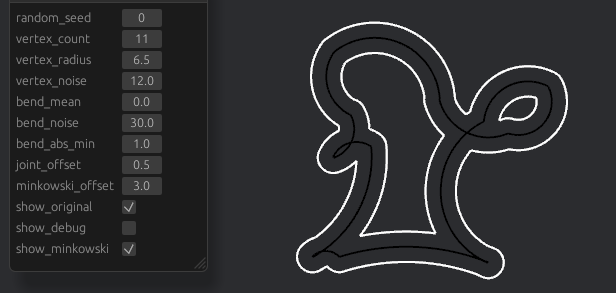

## Rarc (Arcs in Rust)

### Introduction

In plain language this is
an algorithm that takes as input a list of arc-segments (parts of a circles)
\+ a distance,
and makes a boundary around them at this distance.

#### Mathematical description

The problem is basically to find the boundary of a
[*minkowski sum*](https://en.wikipedia.org/wiki/Minkowski_addition)
of 2D shapes $A$ and $B$, where $A$ is a disc with radius $r$ and $B$ is a union of arcs.
That is, we want to find the set

$` \delta B_r = \left\{ x \in \mathbb{R}^2 \;|\; \min_{y \in B} d(x, y) = r \right\}`$

I claim that this set can again be described as a union of arcs,
and we want to find a list of (disjoint) arcs that make up this union.

### Setup

Requirements:
- [rustup](https://www.rust-lang.org/tools/install)

Run:
- `cargo run`
- `cargo run --example [name]` (checkout `./examples` folder)

### Status

Very much work-in-progress/alpha. Issues include:
- Numerical instabilities
- Lack of support for lines (can be viewed as the special case when $r \to \infty$)

### Related projects

Minkowski addition is already implemented in the case where $A$ and $B$ are both polygons
- https://samestep.github.io/minkowski/ (in Rust)
- https://doc.cgal.org/latest/Minkowski_sum_2/index.html#Chapter_2D_Minkowski_Sums (in C++)

Using these solutions with $A$ and $B$ being polygons approximating the disc and arcs,
gives a (probably faster and more stable) solution,
albeit in the form of approximating polygons.